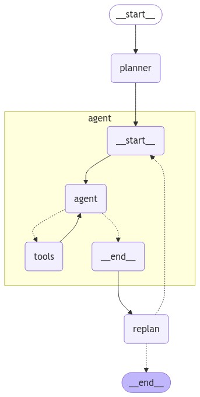
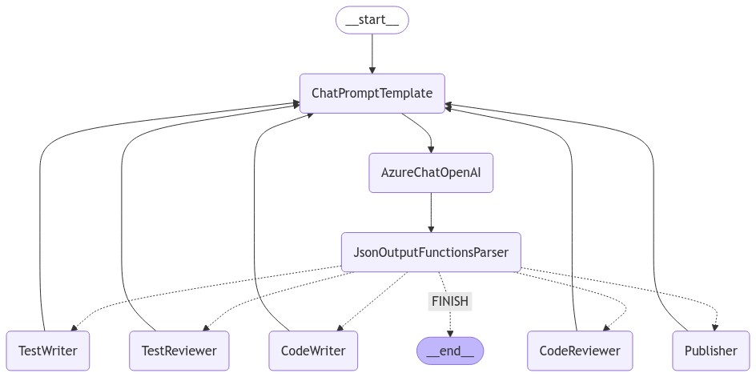
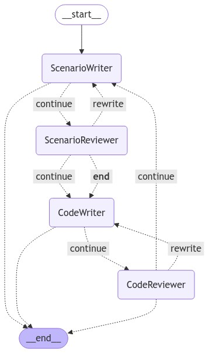

# Multi-Agent Architectures with Langchain

This project explores multiple multi-agent architectures using Langchain (LangGraph), focusing on agent collaboration to solve complex problems. I  implement and compare three main architectures: 
- **Plan and Execute**, 
- **Multi-Agent Supervisor**
- **Multi-Agent Collaborative**. 

Each approach has distinct strengths depending on the complexity of the task at hand, ranging from simple question-answering to generating code and test scenarios across multiple programming languages.

## Technologies Used
- Python 3.10
- Langchain
- Tavily API (optional, can be replaced by DuckDuckGo API)
- Language models (can be any supported by Langchain, such as GPT models. I end up using AzureOpenAI)

## Architectures Overview

### 1. Plan and Execute

This architecture involves a single agent that takes user input, plans based on the question, and executes a series of steps to provide an answer. It is ideal for simple, well-defined tasks such as a question-and-answer process or light planning.



#### Example Use Case: Planning a Trip to Beijing
- **Input:** "What are the top 5 places I should visit?"
- **Plan:** The agent formulates a plan to research top tourist destinations in Beijing.
- **Execution:** The agent retrieves and ranks the top 5 places to visit in Beijing, presenting the result.

This architecture emphasizes clear task segmentation where a single agent can follow predefined steps to completion.

### 2. Multi-Agent Supervisor

In this architecture, multiple agents are deployed to handle distinct aspects of a complex problem. A **supervisor agent** oversees task distribution and ensures that each agent works independently but in coordination. This model is beneficial when generating varied outputs that need verification and revision.



#### Example Use Case: Code Generation with Revision
- **Objective:** "Generate a Python script for calculating Fibonacci numbers, a JavaScript version of the same algorithm, and then review both for optimization."
- **Supervisor:** Assigns tasks to the Python agent and JavaScript agent to generate code.
- **Agents:** 
  - **Python Agent:** Creates the Python version.
  - **JavaScript Agent:** Creates the JavaScript version.
- **Revisor Agents:** Specialized agents for Python and JavaScript review the code for correctness and optimization.
- **Supervisor:** Collects and consolidates the final reviewed code.

This architecture suits tasks that need coordination between creation and revision phases, with a focus on quality assurance.

### 3. Multi-Agent Collaborative

The Collaborative architecture emphasizes real-time interaction between agents to solve a problem more holistically. Agents share information and contribute collectively to the same task, iterating on each other's work. This model is ideal for scenarios where the problem is more fluid and requires creative input from multiple perspectives.



#### Example Use Case: Complex Programming with Test Scenario Generation
- **Objective:** "Generate a C# program that calculates matrix multiplication and also create test scenarios for the code."
- **Agents:** 
  - **C# Code Generator Agent:** Writes the initial matrix multiplication program.
  - **Test Scenario Agent:** Generates test scenarios for the matrix multiplication program.
  - **C# Code Revisor Agent:** Reviews the generated code and tests.
- **Collaboration:** The agents exchange results, improving both the code and test cases iteratively, with frequent communication between agents to refine the solution.

This architecture is best suited for problems that require continuous back-and-forth communication and iteration to reach an optimal solution.

## How to Run the Project

1. Clone the repository:
```bash
   git clone https://github.com/yourusername/multi-agent-langchain.git
   cd multi-agent-langchain
```

2. Set up your environment:
```bash
    python3 -m venv venv
    source venv
    pip install -r requirements.txt
```